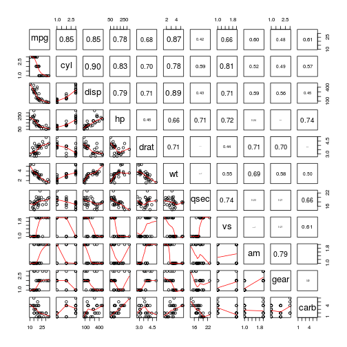
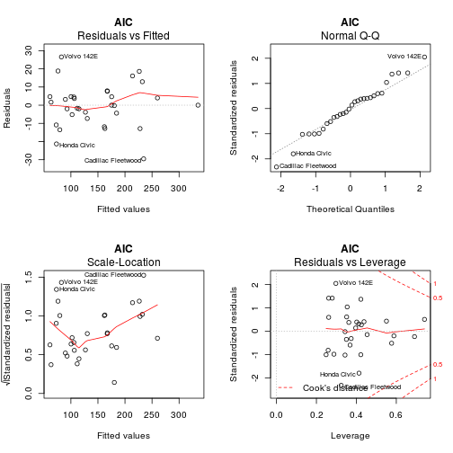

Coursera Final Project Report - Developing Data Products Course
========================================================
author: Steven Burnett
date: 

Introduction
========================================================

We were tasked with exploring the relationship between a set of variables and MPG. The two questions that were of interest are:1. Is an automatic or manual transmission better for MPG?
2. Quantify the MPG difference between automatic and manual transmissions?
Our results indicate that if a linear model is required, then the best model will have the outcome MPG governed by weight (wt), cycle (cylc), horsepower (hp) and transmission (am).
Our findings show the average MPG:Automatic = 17.15 & Manual = 24.39, and Manual cars get 1.81 miles better per gal.

Loading Data and Exploratory Data Analyses
========================================================


We explore the relationship between all of the variables with smoothing in the lower panel and correlations on the upper panels with size proportional to the correlations.
We notice that MPG is highly correlated with weight (wt), and then cycle (cyl) and displacement (disp).However, MPG is slightly correlated with transmission(am)




Testing Models
========================================================


```
Analysis of Variance Table

Model 1: hp ~ am
Model 2: hp ~ am + wt
Model 3: hp ~ am + wt + mpg + drat
Model 4: hp ~ am + wt + mpg + drat + qsec + vs
Model 5: hp ~ am + wt + mpg + drat + qsec + vs + gear + carb
Model 6: hp ~ am + wt + mpg + drat + qsec + vs + gear + carb + cyl
Model 7: hp ~ am + wt + mpg + drat + qsec + vs + gear + carb + cyl + disp
  Res.Df    RSS Df Sum of Sq        F    Pr(>F)    
1     30 137107                                    
2     29  69788  1     67319 237.2340 1.335e-10 ***
3     27  45101  2     24688  43.5000 5.704e-07 ***
4     25  27152  2     17949  31.6261 4.164e-06 ***
5     18  12390  7     14762   7.4316 0.0005983 ***
6     16   4727  2      7663  13.5023 0.0004425 ***
7     15   4256  1       471   1.6583 0.2173496    
---
Signif. codes:  0 '***' 0.001 '**' 0.01 '*' 0.05 '.' 0.1 ' ' 1
```

It looks like model 7 is the worse for modeling horse power. Next, we will try the AIC algorithm

AIC Algorithm
========================================================

```r
step_summary <-summary(step(lm(hp ~ ., data=mtcars), direction = "both"))
```

```
Start:  AIC=190.49
hp ~ mpg + cyl + disp + drat + wt + qsec + vs + am + gear + carb

       Df Sum of Sq     RSS    AIC
- am    1       1.1  4257.6 188.50
- qsec  1       8.5  4265.0 188.56
- drat  1      27.4  4283.9 188.70
<none>               4256.5 190.50
- wt    1     351.6  4608.1 191.03
- disp  1     470.6  4727.1 191.85
- vs    1     878.8  5135.3 194.50
- gear  2    1219.1  5475.6 194.55
- mpg   1     907.5  5164.0 194.68
- cyl   2    2593.9  6850.4 201.72
- carb  5    8253.8 12510.3 214.99

Step:  AIC=188.5
hp ~ mpg + cyl + disp + drat + wt + qsec + vs + gear + carb

       Df Sum of Sq     RSS    AIC
- qsec  1      15.8  4273.4 186.62
- drat  1      28.4  4286.0 186.72
<none>               4257.6 188.50
- wt    1     372.2  4629.8 189.19
- disp  1     539.9  4797.5 190.32
+ am    1       1.1  4256.5 190.50
- mpg   1     910.1  5167.8 192.70
- gear  2    1245.6  5503.2 192.72
- vs    1    1065.7  5323.3 193.65
- cyl   2    2606.0  6863.6 199.78
- carb  5    9058.2 13315.9 214.99

Step:  AIC=186.62
hp ~ mpg + cyl + disp + drat + wt + vs + gear + carb

       Df Sum of Sq     RSS    AIC
- drat  1      28.3  4301.7 184.83
<none>               4273.4 186.62
+ qsec  1      15.8  4257.6 188.50
- disp  1     558.5  4831.9 188.55
+ am    1       8.4  4265.0 188.56
- wt    1     562.2  4835.5 188.58
- mpg   1     941.9  5215.3 191.00
- vs    1    1134.1  5407.5 192.15
- gear  2    1526.0  5799.4 192.39
- cyl   2    2747.2  7020.6 198.51
- carb  5   10439.8 14713.2 216.18

Step:  AIC=184.83
hp ~ mpg + cyl + disp + wt + vs + gear + carb

       Df Sum of Sq     RSS    AIC
<none>               4301.7 184.83
+ drat  1      28.3  4273.4 186.62
+ qsec  1      15.7  4286.0 186.72
+ am    1      10.3  4291.3 186.76
- disp  1     565.9  4867.6 186.79
- wt    1     697.2  4998.9 187.64
- mpg   1     917.9  5219.6 189.02
- vs    1    1132.2  5433.9 190.31
- gear  2    1504.1  5805.8 190.43
- cyl   2    3483.0  7784.7 199.81
- carb  5   11188.7 15490.4 215.83
```

```r
step_summary$coefficients
```

```
               Estimate Std. Error    t value     Pr(>|t|)
(Intercept) 150.8706793  44.824462  3.3658112 0.0034424114
mpg          -2.4687631   1.259701 -1.9598006 0.0656889330
cyl6        -15.6787657  13.565542 -1.1557788 0.2628830657
cyl8         48.9226514  32.031353  1.5273364 0.1440585868
disp          0.2498685   0.162371  1.5388742 0.1412292702
wt          -20.9413313  12.260494 -1.7080332 0.1048182621
vs1          26.0210387  11.955039  2.1765750 0.0430691941
gear4        -9.1924768  14.714219 -0.6247343 0.5399846326
gear5        25.5046094  16.457487  1.5497268 0.1386104041
carb2        -4.4356771  10.083146 -0.4399101 0.6652387832
carb3        32.3673197  22.284730  1.4524438 0.1635879699
carb4        52.4036881  15.867853  3.3025065 0.0039593395
carb6        84.7146676  27.859560  3.0407755 0.0070324947
carb8       146.2836466  30.711543  4.7631487 0.0001554174
```

```r
step_summary$adj.r.squared
```

```
[1] 0.9491619
```

```r
best_fit <- lm(hp~mpg + cyl + disp + wt + vs + gear + carb,data = mtcars)
```
Using the AIC method, it appears that  mpg, cyl, disp, wt, vs, gear, and carb are good predictors for hp.

```r
par(mfrow=c(2,2))
plot(best_fit,main = "AIC")
```



While examining the plots, it looks like we have a good regression model obtain from the AIC method. (Residuals vs Fitted) The residuals are scattered with no observable trend. The smooth curve is relatively flat, and is good enough to suggest a linear fit is optimal. 


